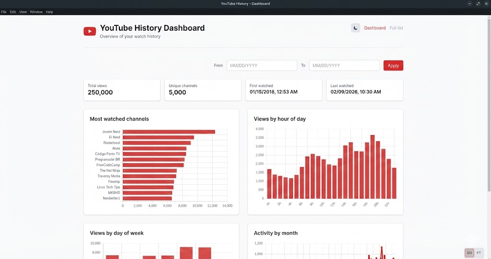

# YouTube History Dashboard

View and analyze your YouTube watch history on your computer and on your network.



## What it does

Use your history exported from Google Takeout: see charts by hour, day of week and month, most watched channels, and a full list of videos. Everything runs locally and can be accessed from other devices on your network.

## How to use

1. Install the app (desktop or Docker, see below).
2. Open the setup screen and import the `histórico-de-visualização.html` file (or `watch-history.html`) from your Takeout export.
3. Use the dashboard and history list on this device or on any device on the same network—open in a browser the address shown on the setup screen (toast).

## How to install

### Desktop

Download the installer for Windows, macOS or Linux from the [Releases](https://github.com/your-org/youtube-history-dashboard/releases) page (or the project’s download link). Install and run; the app will open in a window and show the setup page on first run.

### From source (development)

From the project root, run `make dev` to install dependencies, build the API and web app, run the database migration, and start the Electron app. See [docs/development.md](docs/development.md) for other Makefile targets and details.

### Docker

1. Put your Takeout export in the `youtube-metadata/` folder (e.g. `youtube-metadata/histórico/histórico-de-visualização.html`).
2. Run:

```bash
docker compose up --build
```

3. Open `http://localhost:3000` in your browser.

## Where to get your history

1. Go to [takeout.google.com](https://takeout.google.com).
2. Select only YouTube (or YouTube and YouTube Music).
3. Export and download the ZIP file.
4. Inside the ZIP, open the YouTube folder and find the history file (e.g. `histórico/histórico-de-visualização.html` or `history/watch-history.html`).

The setup screen in the app also explains these steps.

## Technical documentation

- [docs/development.md](docs/development.md) – How to run locally, environment variables, build and tests, API reference.
- [docs/architecture.md](docs/architecture.md) – API and web structure; how to add routes.
- [docs/coding-standards.md](docs/coding-standards.md) – Code style and conventions.
- [docs/electron.md](docs/electron.md) – Desktop app structure and packaging.
